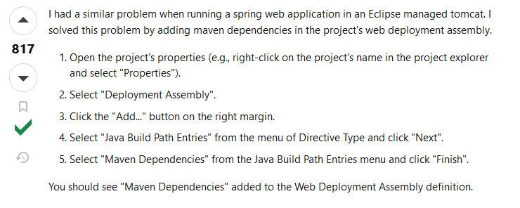
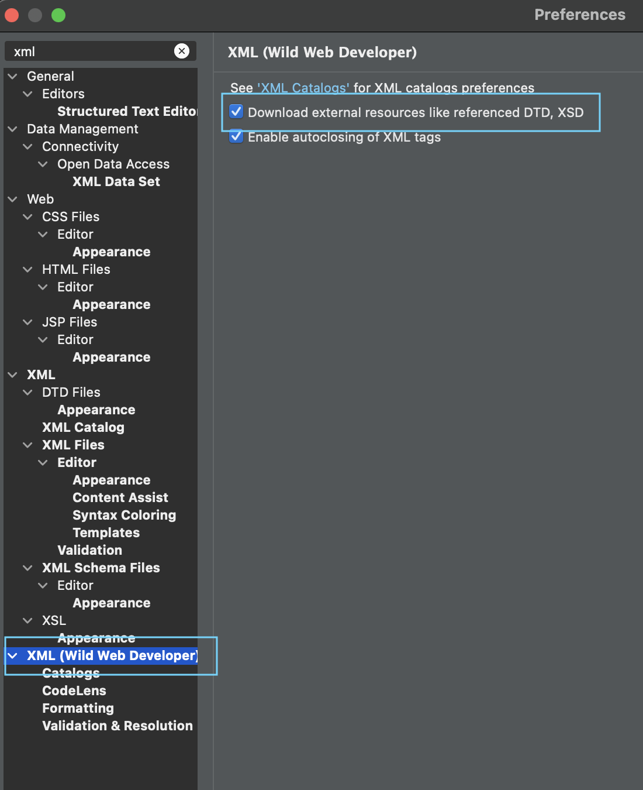

# Tutorial Sites

[Spring MVC Tutorial | Full Course](https://www.youtube.com/watch?v=g2b-NbR48Jo&t=1514s)

CheatSheet
[text](cheetSheetSpring.pdf)

# Version
Spring Boot 5
Dynamic web module must be version 4,
java version can be 17.
Tomcat must be version 9.0

Solving Problems




## Spring 4:

Springboot 1.5

- Spring 4 was the first version of the framework to fully support Java 8. This meant Spring-based applications could utilize Java 8's new features like lambda expressions, method references, and default methods. Configuration could still be done in two main ways:
- XML configuration: The older method of configuration using XML files, such as the web.xml file you mentioned. This was often used to define beans and their dependencies.
- Java-based configuration: Introduced in Spring 3, this allows for configuration using Java classes annotated with @Configuration, @Component, @Service, @Repository, etc. Beans can be defined in the configuration class using the @Bean annotation.
- Spring 4 supports Servlet 3.0 API and can therefore run on Tomcat 7 and later versions. However, it's often recommended to use Tomcat 8 as it provides complete support for Servlet 3.1 and JSP 2.3 specifications.

## Spring 5:

Springboot 2
- Spring 5 added support for Java 9, 10, 11, and Reactive Programming, along with many other features. Configuration in Spring 5 still supports both XML and Java-based configurations, but with an emphasis on the latter:

- XML configuration: While still available, the usage of XML configuration is generally discouraged in favor of Java-based configuration.

- Java-based configuration: Continues to be the preferred method. This includes the use of @Configuration, @Bean, and other similar annotations.

- Annotation-based configuration: Spring 5 continues to build upon the annotation-based configuration options that were introduced in Spring 3 and 4. It introduced new annotations like @ConditionalOnMissingBean, @ConditionalOnProperty, etc. to provide more control over bean creation and context configuration.

-Java 8 and Java EE 7

## Spring version 6 totally migrated to Jakarta EE and no longer works with javax

- web.xml and config.xml still work
- Requires Tomcat 10
- Requires Jakarta EE instead of Javax
- for sprinboot 3
- Java 17
- Compatible with latest web servers: Tomcat 10.1, Jetty 11, Undertow 2.3.
-Spring 6: This version moved to Jakarta EE 9 and its respective library dependencies
## Tomcat 9 Only works with Spring Version 5
- uses javax
- Tomcat 9 supports Servlet API version 4.0 and JSP API version 2.3
-  Tomcat 9 requires Java 8 or later

-pom.xml dependancies
```
<dependencies>.

  <!-- Spring MVC -->
  <dependency>
    <groupId>org.springframework</groupId>
    <artifactId>spring-webmvc</artifactId>
    <version>5.3.9</version> <!-- or the version you want -->
  </dependency>
  <!-- Servlet API -->
  <dependency>
    <groupId>javax.servlet</groupId>
    <artifactId>javax.servlet-api</artifactId>
    <version>4.0.1</version>
    <scope>provided</scope>
  </dependency>

  <!-- JSP API (if required) -->
  <dependency>
    <groupId>javax.servlet.jsp</groupId>
    <artifactId>javax.servlet.jsp-api</artifactId>
    <version>2.3.3</version>
    <scope>provided</scope>
  </dependency>

  <!-- JSTL (if required) -->
  <dependency>
    <groupId>javax.servlet</groupId>
    <artifactId>jstl</artifactId>
    <version>1.2</version>
  </dependency>
</dependencies>
```

## Tomcat 10
- uses jakarta
- while Tomcat 10 supports Servlet API version 5.0 and JSP API version 3.0.
- while Tomcat 10 requires Java 11 or later
- In Tomcat 10, web applications can be developed using the Servlet 5.0 and JSP 3.0 specifications, which introduce new features and improvements. With these versions, you can configure your web application using annotations, Java code, and declarative configuration files.
- web.xml replacement: In Tomcat 10, web.xml is no longer the primary configuration file for web applications. Instead, you can use annotations such as @WebServlet, @WebFilter, and @WebListener directly in your servlet classes to configure them. This approach eliminates the need for a separate deployment descriptor file.
- Simplified configuration: Tomcat 10 encourages a simpler and more flexible configuration model. You can use various configuration options, including the default web application configuration file (META-INF/context.xml) or per-web application context files (WEB-INF/context.xml), to configure specific settings like data sources, resource references, and more.
- pom.xml
```
<dependencies>
  <!-- Spring MVC -->
  <dependency>
    <groupId>org.springframework</groupId>
    <artifactId>spring-webmvc</artifactId>
    <version>5.3.9</version> <!-- or the version you want -->
  </dependency>
  <!-- Servlet API -->
  <dependency>
    <groupId>jakarta.servlet</groupId>
    <artifactId>jakarta.servlet-api</artifactId>
    <version>5.0.0</version>
    <scope>provided</scope>
  </dependency>

  <!-- JSP API (if required) -->
  <dependency>
    <groupId>jakarta.servlet.jsp</groupId>
    <artifactId>jakarta.servlet.jsp-api</artifactId>
    <version>3.0.0</version>
    <scope>provided</scope>
  </dependency>

  <!-- JSTL (if required) -->
  <dependency>
    <groupId>jakarta.servlet.jsp.jstl</groupId>
    <artifactId>jakarta.servlet.jsp.jstl-api</artifactId>
    <version>2.0.0</version>
  </dependency>
</dependencies>

```
## tomcat 9 and 10 difference

For copyright reasons the Servlet 5.0 API (implemented by Tomcat 10) and the Servlet 4.0 API (implemented by Tomcat 9) are incompatible: the API namespace changed from javax._ to jakarta._. This can manifest in many ways:


xxxxxxxxxxxxxxxxxxxxxxxxxxxxxxxxxxxxxxxxxxxxxxxxxxxxxxxxxxxxxxxxxxxxxxxxxxxxxxxxxxxxxxxxxxxxxxx